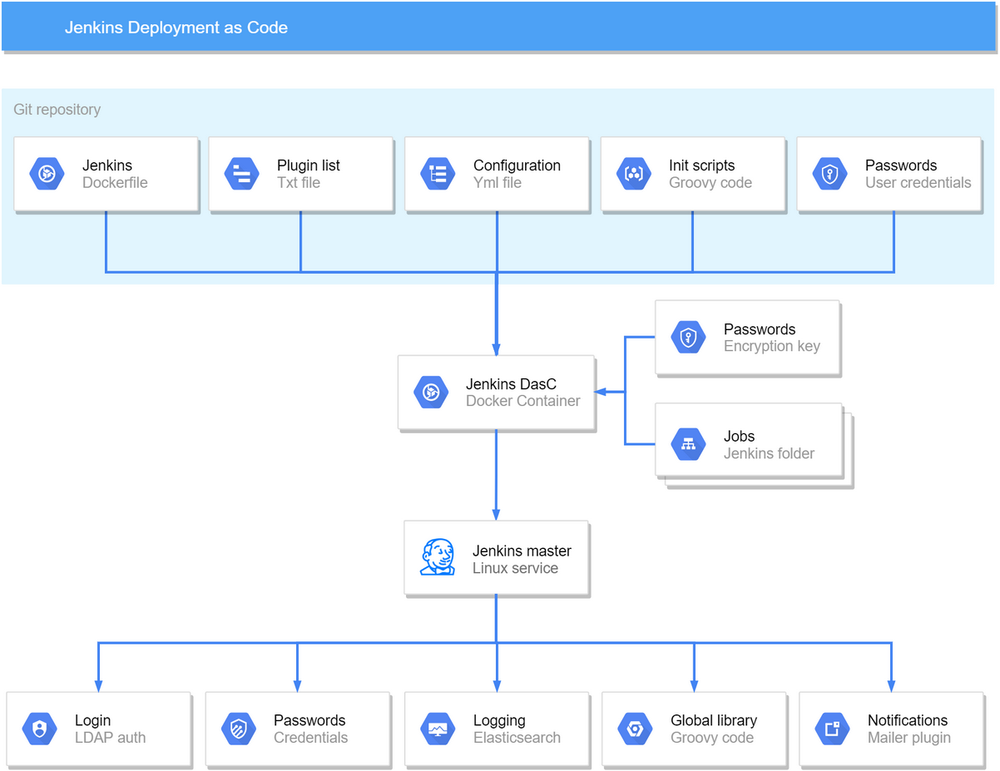

# Fully automated deployment and configuration of Jenkins 

Collection of Init scripts, configurations and executable Jenkinsfiles loaded automatically into a dockerized Jenkins.

### Why

Jenkins is easy to manually install and configure using the GUI but there are many drawbacks of setting upp servers in this way. 

Testability:
There is no way to test how upgrading the Jenkins server or any plugin will affect other jobs. The oly way is to live deploy and hope that it will be possible to rollback if the tests fail. Rollback rarely works, most issues arrise from interplugin dependencies.

Scalabilityt:
There is no way to setup an identical server on another site. The only way is to install it and compare the configuration pages. Checking the same boxes and copy/pasting the configuration options.

Maintainability:
Easier to maintain when environment, configuration, plugins and jobs are stored in SCM.
It is possible to mass manage Jenkins instances by generating them from the same codebase and only apply the different configurations that are project/server specific.

[Jenkinsfile](https://jenkins.io/doc/book/pipeline/jenkinsfile/) documentation lacks examples when it comes to working with jenkinsfiles in a project.
There is a need of working with job configurations that is versitile and universal. It should be possible to read and modify configutrations from GUI but there must also be possible tu use a IDE tool and modify the code localy.
In order to achieve this all code needs to be stored in SCM and all permanent changes need to be checked in and versioned.
Changes not checked in will automaticaly be overwritten after each new commit in the repository.

### How it works

A Docker image is built according to the steps in Dockerfile.
Docker compose will build and start the container with arguments located in docker-compose.yaml file.
Steps are: 
    -A docker image containing Jenkins is pulled from Docker hub.
    -All plugins are downladed and installed to the jenkins instance.
    -Jenkins2.sh will apply basic configuration and call jenkins.sh script to apply aditional configurations to Jenkins processes.
    -Docker compose will map in resources needed for jenkins to boot.
    -Jenkins Groovy init scripts will be executed and create initial jobs on the Jenkins server if they are not already created and mapped.
    -Jenkins configuration as code will read jenkins.yaml configuration file and apply all configuration to both Jenkins and all the plugins.
    -Jenkins process will finish its boot procedure and is ready to for use.

### Run

This will pull and start latest docker images

    docker-compose pull
    docker-compose up
   
If you have problem with mounting `/var/run/docker.sock` then remove it from `docker-compose.yml` but you won't be able to run jobs which use docker as an agent.

Wait for Jenkins to boot up. Authentication is disabled. Open a browser and go to:

    localhost:8080
    
If you don't see any jobs run Generate_jobs_from_code_dev job

To stop running Docker contianer press `CTRL+C` in terminal.  

To remove all containers with all of its data run:

    docker-compoes down

---

### Updating Jenkins

If you wish to update jenkins for some reason then:

1. Update jenkins version in `Dockerfile`
2. Rebuild docker image and start a new jenkins container.
3. Manually update jenkins plugins using the `Install or update Jenkins plugins` guide.

### Install or update Jenkins plugins

If you just want to test new plugins without committing them to git then stop at step 2.

1. Start jenkins container.
2. Manually install or update plugins through the UI.
3. Restart jenkins to verify it's still working.
4. Copy output of the following command to `plugins.txt` file (located in this repository):

        curl -s http://localhost:8080/pluginManager/api/json?depth=1 \
          | jq -r '.plugins[] | "\(.shortName):\(.version)"' \
          | sort
    
5. Rebuild docker image and start a new containers to verify new plugins have been installed:

        docker-compose down
        docker-compose build
        docker-compose up
          
To completeley clean and rebuild everything run this command:

        docker-compose down && docker-compose build --no-cache && docker-compose up --force-recreate